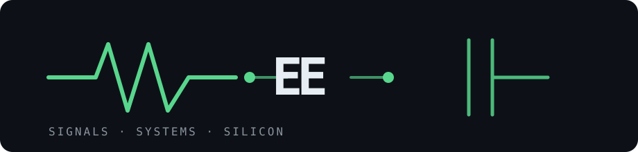

<div align="center">



# Leandro Berne

**Electrical Engineering & Information Technology @ ETH Zürich**

*Building at the intersection of intelligent systems, embedded hardware, and quantitative models.*

[github](https://github.com/leandro-3rne)

</div>

---

## about

> EE student, engineer by instinct, curious by default.<br>
> I enjoy turning theory into systems that move, measure, decide, and work.

Currently exploring **robotics**, **embedded systems**, **signal processing**, and
**quantitative finance** — from motor drivers and sensor feedback to stochastic models
and order books. I like projects with a real interface to the physical world, a clear
mathematical core, and enough complexity to learn something useful.

## stack

<samp>python &nbsp; c++ &nbsp; matlab &nbsp; arduino &nbsp; esp32 &nbsp; opencv &nbsp; tensorflow &nbsp; onnx &nbsp; numpy &nbsp; scipy &nbsp; git &nbsp; linux</samp>

<br>

**Interested in:** control & estimation · computer vision · embedded software · signal processing · numerical methods · market making

## selected work

**[Mecanum Line Follower Robot](https://github.com/leandro-3rne/pid-line-follower-rc)** &nbsp;·&nbsp; <samp>arduino, c++, sensors, control</samp><br>
An autonomous robot using a 5-channel infrared sensor array, DC motors, and a TB6612FNG
driver. Built as a line-following platform, with the next iteration moving toward
independent Mecanum-wheel control on ESP32.

**[HandMatrix](https://github.com/leandro-3rne/handmatrix-gesture-recognition)** &nbsp;·&nbsp; <samp>c++, python, opencv, tensorflow, onnx</samp><br>
Real-time hand-gesture recognition from webcam input. Includes a custom C++ MLP with
backpropagation, a CNN pipeline, data augmentation, and ONNX deployment for live inference.

**[Prosperity 4 — Quantitative Finance Toolkit](https://github.com/leandro-3rne/prosperity4-quant)** &nbsp;·&nbsp; <samp>python, stochastic calculus, market making</samp><br>
Self-study and implementation work for algorithmic trading: Black–Scholes, stochastic
processes, Avellaneda–Stoikov market making, statistical arbitrage, and game theory.

**[Kirchhoff CLI](https://github.com/leandro-3rne/kirchhoff-cli)** &nbsp;·&nbsp; <samp>python, sympy, cli</samp><br>
A terminal toolkit for everyday EE calculations: impedance networks, circuit laws,
RC/RL transients, Fourier series, Taylor expansions, and SI-aware engineering units.

**[DFT Basics & EEG Analysis](https://github.com/leandro-3rne/dft-basics-and-eeg-analysis)** &nbsp;·&nbsp; <samp>python, scipy, mne, signal processing</samp><br>
An exploratory signal-processing project connecting DFT/FFT fundamentals with EEG and
sleep-stage analysis in reproducible notebooks.

**[Matrix Decompositions](https://github.com/leandro-3rne/matrix-decompositions)** &nbsp;·&nbsp; <samp>python, numpy, scipy, sympy</samp><br>
Interactive numerical linear algebra: implement, visualise, and validate core matrix
decompositions from LU and QR to SVD, Schur, Jordan, and polar forms.

## current direction

```text
hardware  →  sensors, motors, power, embedded interfaces
software  →  robust control, computer vision, numerical tooling
research  →  signals, systems, stochastic models, optimisation
goal      →  intelligent machines and decision systems that hold up in the real world
```

## beyond the code

I use GitHub as an engineering notebook: a place to document experiments, derive the
math, test ideas, and share the systems that survive contact with reality.

<div align="center">

<sub>ETH Zürich · Electrical Engineering & Information Technology · Switzerland</sub>

</div>


# About Me

I'm a second-year **Electrical Engineering and Information Technology (BSc)** student at **ETH Zürich**, passionate about building intelligent systems at the intersection of **robotics, embedded systems, software engineering, and data science**.

I enjoy combining hardware and software to create practical engineering projects — from autonomous robots and custom electronics to signal processing, computer vision, and machine learning applications.

---

## Tools & Technologies

### Programming
- C++
- Python
- MATLAB
- LaTeX

### Engineering & Development
- Git & GitHub
- VS Code
- Cursor
- Arduino IDE
- Linux / CLI Tooling
- PCB Design
- 3D Printing
- Electronics

---

## Areas of Interest

- Robotics & Autonomous Systems
- Embedded Systems
- Computer Vision
- Machine Learning
- Signal Processing
- Data Analysis
- Quantitative Finance
- Control Systems
- Electronics Design
- Open-Source Engineering
- Jazzpiano

---

## Get in Touch

[](https://leandro-erne.vercel.app)

[](https://www.linkedin.com/in/leandro-ern%C3%A9-ab673135a/)

[](mailto:leandro.erne@proton.me)
